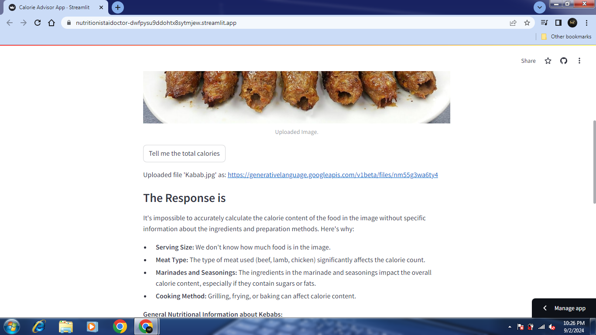

# Calorie Advisor App

[](https://streamlit.io/)

[](https://ai.google.dev/gemini-api/docs/models/gemini#gemini-1.5-flash)
[](https://ai.google.dev/)

## Project Name: **Calorie Advisor App**

The **Calorie Advisor App** is a web application developed using Streamlit and Google Generative AI's Gemini model. The app allows users to upload an image of food items, and it provides detailed nutritional analysis, including calorie counts and health assessments.

## Features ⚒️
1. **Image Upload**: Upload images of food items in formats like JPG, JPEG, and PNG.
2. **Nutritional Analysis**: Get a detailed breakdown of calories and a health assessment based on the food items in the image.
3. **Google Gemini API Integration**: Utilizes Google Generative AI's Gemini model to analyze the food image and generate nutritional insights.

## How to Use the Application
1. Open the application using Streamlit.
2. Upload an image of the food items you want to analyze.
3. Click on the "Tell me the total calories" button.
4. The application will display the total calories, a breakdown of each food item, and additional nutritional details.

## Installation
To set up the application locally, follow these steps:

1. **Clone the repository**:
   ```sh
   git clone https://github.com/ShifaZahra123/calorie-advisor-app.git
   ```

2. **Navigate to the project directory**:
   ```sh
   cd calorie-advisor-app
   ```

3. **Install the required dependencies**:
   ```sh
   pip install -r requirements.txt
   ```

4. **Set up the environment variables**:
   - Create a `.env` file in the project root directory.
   - Add your `GOOGLE_API_KEY` in the `.env` file:
     ```
     GOOGLE_API_KEY=your_google_api_key_here
     ```

5. **Run the Streamlit application**:
   ```sh
   streamlit run app.py
   ```

## Sample Application Workflow

